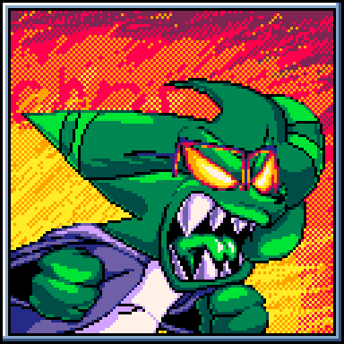
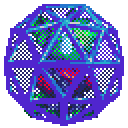

# About the Furry (This README.md is a wip, im still learning how to use github)
Yo I'm ChrisFurry, I'm 16 and I somehow know how to do shit
## Stuff I do
| Stuff I do | What I can program in | Programs I use |
| --- | --- | --- |
| Draw | Clickteam Fusion 2.5 | Aseprite |
| Pixel Art | Gamemaker Language | Animate CC |
| Animation | Haxe (little) | Visual Studio Code |
| Code | Lua ~~Except I hate lua~~ | Gamemaker Studio 2 (prefer 1.4) |
| Slight 3D modeling | Maybe more in the future | Blender (little) |
## Art Examples
| Pixel Art | Blender |
| :---: | :---: |
|  |  |
| PFP thing I did for myself. | Blender Pixel art |
|  | |
| PFP thing I did.. but for !JDrive! |  |
## What I'm working on / What I have worked on
| Current Status | Project |
| :--- | ---: |
| Hibernation |Techno-Break (My game) |
| Released | Needlemouse Framework: My Sonic Framework |
## Misc
| Likes & Interests | Favorite Hardware / Engines |
| :--- | ---: |
| Seeing Other's Code | The Sega Megadrive/Genesis |
| Other People's Art | Sonic Physics |
| Sonic Fangames (That try to be different) | Source Engine |
## You can talk to me if you want ig
* Discord: ChrisFurry#0275
* Twitter: @ChrisFurry2005
