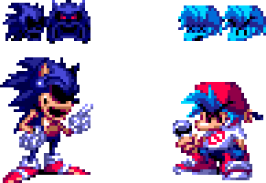
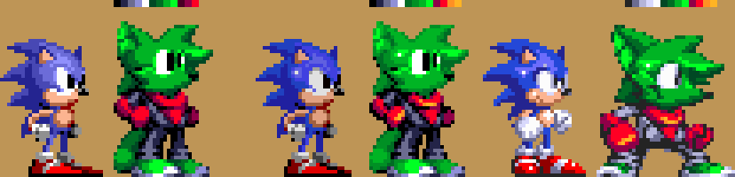

# The dumbass himself

Yo I'm ChrisFurry, I'm 16 and I somehow know how to do shit

## Stuff I do
| Stuff I do | What I can program in | Programs I use |
| :--- | :---: | ---: |
| Draw | Clickteam Fusion 2.5 | Aseprite |
| Pixel Art | Gamemaker Language | Animate CC |
| Animation | Haxe (little) | Visual Studio Code |
| Code | Lua ~~Except I **LOVE** lua~~ | Gamemaker Studio 2 (prefer 1.4) |
| Slight 3D modeling | Maybe more in the future | Blender (little) |
## Art Examples
| Pixel Art | Blender | Animation |
| :---: | :---: | :---: |
|  |  |  |
| PFP thing I did for myself. | Blender Pixel art | Pixel ver of NotSoAdvanced's YCR Sonic.exe |
|  | |  |
| PFP thing I did.. but for !JDrive! |  | Thing i did based off of the funny sonic dance gif |
|  |  |  |
| RivalsOA Spritework |  |  |
|  |  |
| Sonic Spritestyle Practice |  |
## What I'm working on / What I have worked on
| Current Status | Project |
| :--- | ---: |
| Hibernation |Techno-Break (My game) |
| Released | Needlemouse Framework: My Sonic Framework |
## Misc
| Likes & Interests | Favorite Hardware / Engines |
| :--- | ---: |
| Seeing Other's Code | The Sega Megadrive/Genesis |
| Other People's Art | Sonic Physics |
| Sonic Fangames (That try to be different) | Source Engine |
## Places I'm on (if you wanna talk to me or check out my stuff)
[Discord](ChrisFurry#2005) | 
[Guilded](https://www.guilded.gg/u/ChrisFurry2005) | 
[Twitter](https://twitter.com/ChrisFurry2005) | 
[Newgrounds](https://chrisfurry.newgrounds.com/) | 
[Itch.io (Needs updating)](https://chrisfurry.itch.io/) | 
[Youtube (Not active)](https://www.youtube.com/channel/UCwN4qToe_0f_99PdNhbaz5g)
